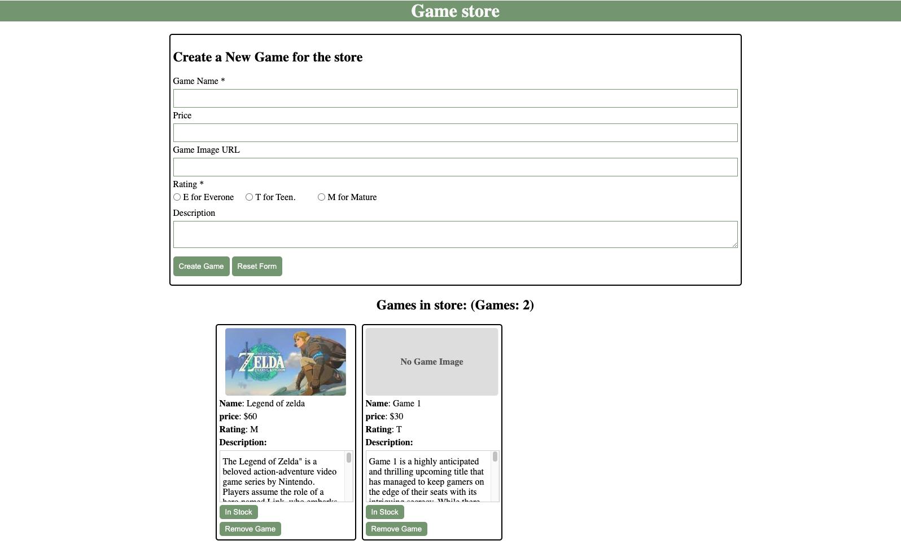

# Game Inventory Web Application Simulation

## Description:
----------------
Introducing an incredible tool designed to bring the experience of managing a virtual game store to life – this project is a remarkable web application that simulates the functionalities of a game store with remarkable precision. It offers users the ability to effortlessly maintain a count of the games available in the store, allowing them to keep track of their inventory with ease. Users can add new games to the store, each accompanied by an immersive game image to enhance the gaming experience. Even when a game image URL is missing or invalid, the project thoughtfully provides a default image to ensure a visually appealing presentation.

Adding to its versatility, this web application empowers users to manage their game collection effectively. Games can be removed from the store with a simple click, ensuring that the inventory remains up-to-date. Additionally, the 'In Stock' button offers an intuitive toggle feature that allows users to indicate the availability status of each game, making it easy for customers to identify which games are currently in stock. With comprehensive inputs for game name, price, image URL, age rating, and descriptions, this project enables users to curate and display detailed information about each game, resulting in an immersive and informative gaming experience. So, dive into this exceptional project to create and manage your very own virtual game store, complete with rich game descriptions and effortless inventory control.  

## Web Link: 

[Visit Our Website](https://michaelarestrepoross.github.io/game-inventory-web-application/)

## Instructions:
-----------------
### Fork the Repository:

1. Visit the GitHub repository for the web application you want to fork.
2. In the top right corner of the repository page, click on the "Fork" button. This will create a copy of the repository in your GitHub account.

### Clone the Forked Repository:

3. On the repository page in your GitHub account, click the "Code" button.
4. Copy the URL of the repository (you can use the HTTPS or SSH URL).
5. Open your terminal or command prompt on your local machine.
6. Navigate to the directory where you want to store the project.

### Clone the Repository:

7. In the terminal, use the git clone command followed by the URL you copied earlier. For example, if you copied the HTTPS URL, the command will look like this:
bash
### Copied code example
        git clone https://github.com/MichaelARestrepoross/game-inventory-web-application.git 
Replace your-username with your GitHub username and repository-name with the name of the repository.

### Access the Project:

8. After the repository is cloned to your local machine, you can access the project files in the cloned directory.

## Store Functions
---------------------------

This web application provides a range of powerful store functions to enhance your virtual game store management experience:

- **Count Tracking:** Keep a real-time count of the games in your store, ensuring that you're always aware of your inventory's status.

- **Add New Games:** Easily add new games to your store with all the relevant information, including name, price, game image URL, age rating, and a captivating description.

- **Default Game Images:** When game images are missing or their URLs are invalid, the application thoughtfully provides default images to maintain a visually appealing presentation.

- **Game Removal:** Streamline your inventory by removing games with a simple click, making sure your store stays up-to-date with the latest offerings.

- **In Stock Toggle:** The 'In Stock' button offers a user-friendly toggle feature, allowing you to indicate the availability status of each game at a glance.

With these comprehensive store functions, you have the tools needed to create and manage a virtual game store that's both informative and efficient. Dive into the world of gaming and watch your virtual inventory come to life.

### Stretch Goals

- Added  deufalt images for games with unloadable image url's.
- Added images for users who wish to have no imput for their desired game.
- Added a counter for Added and removed games. That is live updated as the user adds or removes games from the game store.